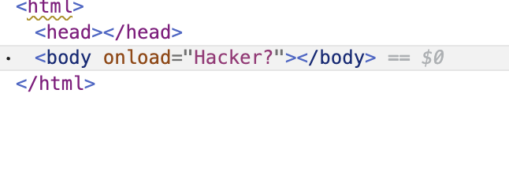
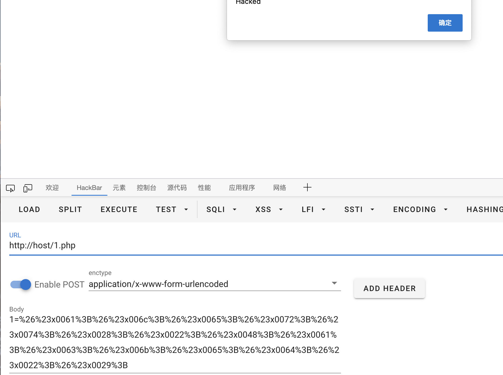

# 事件与html实体编码

当我们能控制事件标签当中的值时，可以尝试使用实体编码绕过黑白名单

这里简单写个测试demo

```php
<?php
function waf($v){
    if (strstr($v,"alert")) {
        return "Hacker?";
    }
    return $v;
}

$a = waf($_POST[1]);
echo "<body onload='$a'></body>";
```


此时当我们传入`1=alert("Hacked")`，则会被waf函数检测拦截



但如果我们使用html实体编码(支持十进制与十六进制)，成功Bypass!


