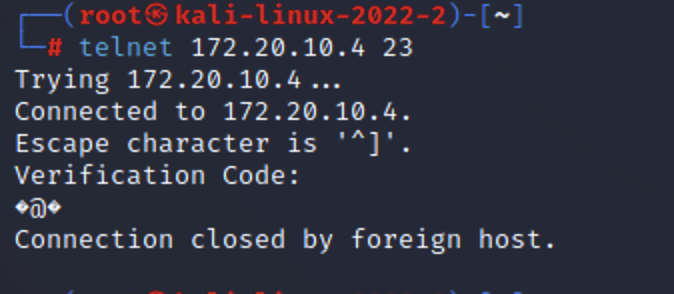

# School

## 端口扫描

```bash
nmap -p- -A ip
```

发现存在三个服务


简单尝试23以后发现需要个认证码之类的先不管了，先去看看web的




## web

直接跳转发现存在一个登录界面


扫描子目录发现很多有趣的文件


从下面看来是基于标准模板的渲染，不过写的很垃圾，还泄漏了用户名


在database下发现sql文件，尝试进一步利用


在这个文件当中发现admin密码admin123


f12发现两处可疑的地方，一个是shell.php另一个是系统设置页面注释掉了


shell无法访问，那只能看看后面了，存在任意文件上传


根据前面信息大概猜到了shell的路径


## tty shell

简单反弹获取一个tty shell


顺手发现一个flag


## 提权

同时发现root目录可进，需要提权才能读proof.txt


发现通过wine运行了一个程序，看名字猜测就知道可能是我们之前看到的那个神秘端口的


发现是pwn是我不会的暂时放着了


留个参考链接http://vxer.cn/?id=5以后会pwn了继续做下
